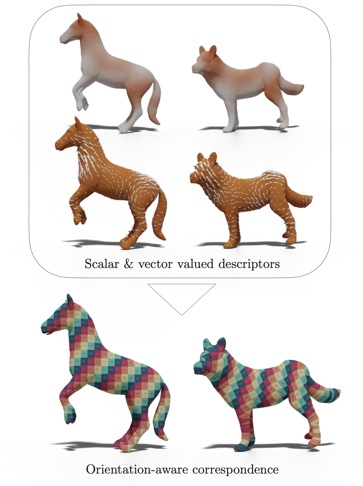

# Deep orientation-aware functional maps: Tackling symmetry issues in Shape Matching
<!-- # DUO-FM: Unsupervised Orientation-Aware Learning for Non-rigid Shape Matching -->

This is our implementation of Deep orientation-aware functional maps, 
a Shape Matching Network that builds comprehensive orientation-aware features from surfaces
to compute accurate correspondence between pairs of shapes.
Our method exploits both scalar-valued and vector-valued features to infer well-oriented maps between shapes,
**in a fully unsupervised manner**.

We chose to call our network **DUO-FM**, for **D**eep **U**nsupervised **O**rientation-aware **F**unctional **M**aps.
Another reason for this name is that this network relies on the computation of two maps: the functional map
for scalar-valued descriptors and the complex functional map for vector-valued descriptors. It is this joint estimation
of both these maps that makes our method robust and able to retrieve orientation-preserving maps without supervision.

> **DUO-FM, Deep orientation-aware functional maps**<br/>
> Nicolas Donati, Etienne Corman, Maks Ovsjanikov<br/>
> In *CVPR 2022*<br/>
<!--
> [PDF](https://arxiv.org/pdf/2112.09546.pdf)
> [Video](https://www.youtube.com/watch?v=U6wtw6W4x3I),
> [Project page](http://igl.ethz.ch/projects/instant-meshes/)
-->

<p align="center">

</p>

## Outline

### Feature Extractor 

Our method is built upon [DiffusionNet](https://github.com/nmwsharp/diffusion-net), a deep feature extractor
for 3D surfaces which shows state-of-the-art results for many shape analysis tasks like classification or segmentation.
We use DiffusionNet to build orientation-aware features that are in turn used for functional map estimation.
The code for DiffusionNet is stored in `diffusion_net/`.

### Complex Functional Maps

Our method uses [Complex Functional Maps](https://github.com/nicolasdonati/QMaps) to link tangent vector field features
between source and target shapes. This allows to efficiently impose an orientation-aware loss on the network,
in order to get well-oriented maps.
The code for Complex Functional Maps is stored in `Tools/`.

## Prerequisites

Our code depends on pytorch (>1.8), as well as a handful of other fairly typical numerical packages,
which can usually be installed manually.

## How to use
-specify your dataset and model parameters in a `config/your_config.yaml` file.
-run `python train.py --config your_train_config` to train **DUO-FM** on your train set with your parameters.
-run `python train.py --model_path path/to/your/model --config your_test_config` to test **DUO-FM** on your test set
with your parameters.

## Citation
If you use our work, please cite our paper.
```
@article{donati2022DeepCFMaps,
  title={Deep orientation-aware functional maps: Tackling symmetry issues in Shape Matching},
  author={Donati, Nicolas and Corman, Etienne and Ovsjanikov, Maks},
  journal={CVPR},
  year={2022}
}
```

## Contact
If you have any problem about this implementation, please feel free to contact via:

nicolas DOT donati AT polytechnique DOT edu