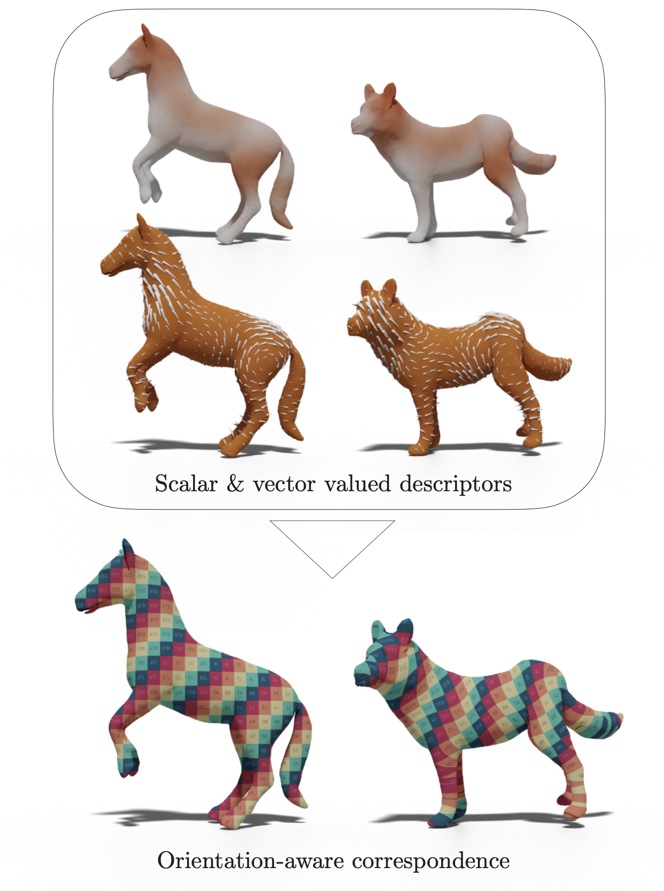
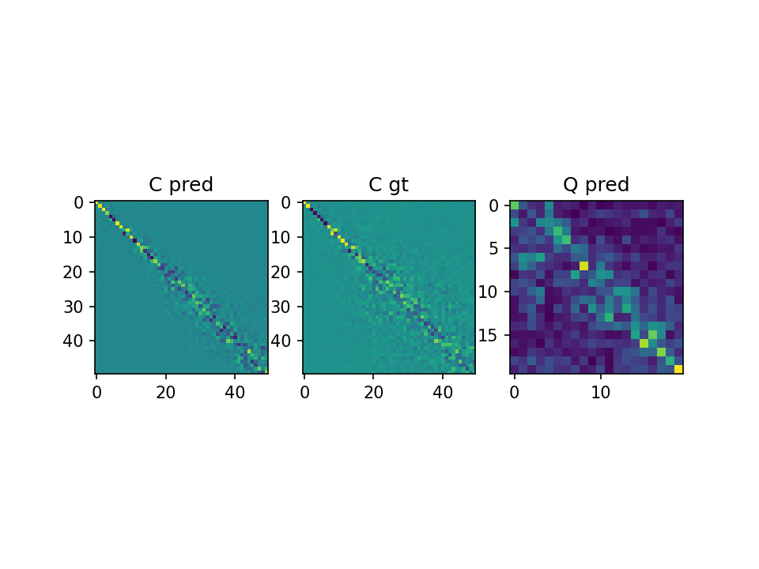

# Deep orientation-aware functional maps: Tackling symmetry issues in Shape Matching
<!-- # DUO-FM: Unsupervised Orientation-Aware Learning for Non-rigid Shape Matching -->

This is our implementation of Deep orientation-aware functional maps, 
a Shape Matching Network that builds comprehensive orientation-aware features from surfaces
to compute accurate correspondence between pairs of shapes.
Our method exploits both scalar-valued and vector-valued features to infer well-oriented maps between shapes,
**in a fully unsupervised manner**.

We chose to call our network **DUO-FM**, for **D**eep **U**nsupervised **O**rientation-aware **F**unctional **M**aps.
Another reason for this name is that this network relies on the computation of two maps: the functional map
for scalar-valued descriptors and the complex functional map for vector-valued descriptors. It is this joint estimation
of both these maps that makes our method robust and able to retrieve orientation-preserving maps without supervision.

> **DUO-FM, Deep orientation-aware functional maps**<br/>
> Nicolas Donati, Etienne Corman, Maks Ovsjanikov<br/>
> In *CVPR 2022*<br/>
> [PDF](https://arxiv.org/abs/2204.13453.pdf)<br/>
<!--
> [Video](https://www.youtube.com/watch?v=U6wtw6W4x3I),
> [Project page](http://igl.ethz.ch/projects/instant-meshes/)
-->

<p align="center">

</p>

## Outline

### Feature Extractor 

Our method is built upon [DiffusionNet](https://github.com/nmwsharp/diffusion-net), a deep feature extractor
for 3D surfaces which shows state-of-the-art results for many shape analysis tasks like classification or segmentation.
We use DiffusionNet to build orientation-aware features that are in turn used for functional map estimation.
The code for DiffusionNet is stored in `diffusion_net/`.

### Complex Functional Maps

Our method uses [Complex Functional Maps](https://github.com/nicolasdonati/QMaps) to link tangent vector field features
between source and target shapes. This allows to efficiently impose an orientation-aware loss on the network,
in order to get well-oriented maps.
The code for Complex Functional Maps is stored in `Tools/`.

## Prerequisites

Our code depends on pytorch (>1.8), as well as a handful of other fairly typical numerical packages,
which can usually be installed manually.

## How to use
To use our method, follow the following steps:

### Configuration
[Here](https://nuage.lix.polytechnique.fr/index.php/s/LJFXrsTG22wYCXx) is the training data we used.
Specify your dataset and model parameters in a `config/your_config.yaml` file. Examples for the config file are
displayed in `config`. The main requirements are the paths to your dataset and some parameters (e.g. number of 
eigenfunctions, number of output descriptors, number of epochs for training, ...).

More specifically, here are the **main** things you need to set in your `config` file :
```bash
├── dataset
│   ├── name         # the name of your dataset (e.g. scape)
│   ├── subset       # the category (e.g. type of remeshing, remeshed or anisotropic, etc...)
│   ├── type_        # vts (uses vts correspondence files) or gt (uses groundtruth files) are the two types supported
│   ├── root_train   # root to your data (e.g. data/SCAPE_r) do not include 'shapes_train'
│   ├── root_test    # same root to data (e.g. data/SCAPE_r) do not include 'shapes_test'
│   ├── root_geodist # root to geodesic distance matrices (only needed for geodesic error eval)
│   ├── cache_dir    # cache for geometric operator used by diffusion net
├── optimizer        # optimizer parameters (no need to change them for first tests)
├── training
│   ├── batch_size   # always 1 for now, because shapes have different numbers of points
│   ├── epochs       # number of training epochs (e.g. 30)
├── fmap
│   ├── n_fmap       # number of eigenvectors used for fmap (e.g. 50 in the paper)
│   ├── n_cfmap      # number of complex eigenvectors used for complex fmap (e.g. 20 in the paper)
│   ├── k_eig        # number of eigenvectors used for diffusion (e.g. 128 in the paper)
│   ├── n_feat       # dimension of output features (e.g. 128 in the paper)
│   ├── C_in: 128    # dimension of input features (e.g. 128 in the paper)
│                    # if C_in=3, xyz signal will be used; if C_in>3, WKS descs will be used
├── loss
│   ├── w_gt         # (default: False) if one wants to train as a supervised method, one should set w_gt=True.
│   ├── w_ortho      # (default: 1) orthogonal loss coefficient for functional map
│   ├── w_Qortho     # (default: 1) orthogonal loss coefficient for complex functional map
├── misc             # cuda parameters and checkpoint frequency
```

It is interesting to note that you can train a **supervised version of the network** with this code,
by simply setting `w_gt: True` in the `loss` section of the `config` file.
This implements **Deep Geometric Functional Maps: Robust Feature Learning for Shape Correspondence**
(find the paper [here](https://arxiv.org/abs/2003.14286.pdf)), with the
difference that the feature extractor in this case is Diffusion Net.

The purpose of this paper is to propose an **unsupervised deep shape matching method**, which you get
by simply setting `w_gt: False` in the `loss` section of the `config` file. This implements **DUO-FM**.

### training
Run `python train.py --config your_train_config` to train **DUO-FM** on your train set with your parameters.

Images of a) the predicted functional map b) the predicted complex functional map c) the ground truth functional 
map for comparison are saved at `img/`.
These images can be used to check that the model gets the maps right after some epochs.
<p align="center">

</p>

### testing
Run `python eval.py --model_path path/to/your/model --config your_test_config` to test **DUO-FM** on your test set
with your parameters. If geodesic distance matrices are available (precise the path through the config file),
the eval code will display geodesic errors after each test map is computed.

## Citation
If you use our work, please cite our paper.
```
@article{donati2022DeepCFMaps,
  title={Deep orientation-aware functional maps: Tackling symmetry issues in Shape Matching},
  author={Donati, Nicolas and Corman, Etienne and Ovsjanikov, Maks},
  journal={CVPR},
  year={2022}
}
```

## Thanks
Parts of this work were supported by the ERC Starting Grant No. 758800 (EXPROTEA) and the ANR AI Chair AIGRETTE.

## Contact
If you have any problem about this implementation, please feel free to contact via:

nicolas DOT donati AT polytechnique DOT edu
